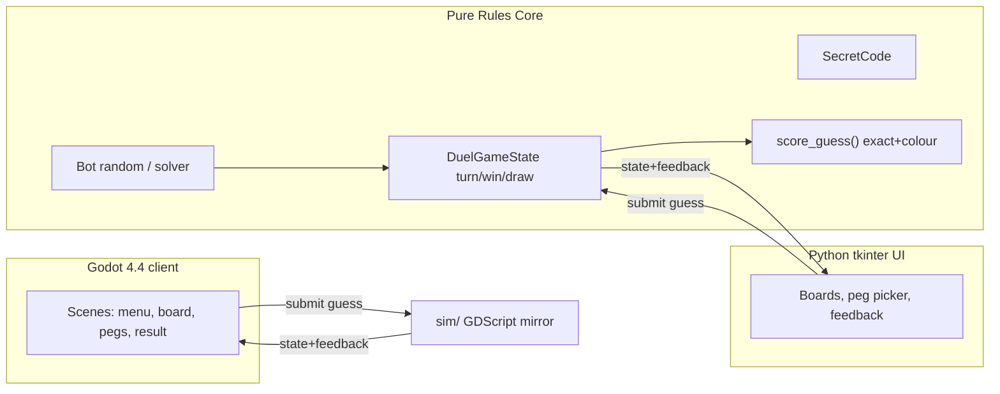

# Duel Mastermind Battle — Build Plan

Two-player duelling Mastermind: 4 pegs, 10 colours, repeats allowed, max 12 guesses, Mastermind feedback (exact + colour-only). Local hot-seat first, then bot, then Godot 4.4.x 2D, then web/Android export readiness.

## PRIMARY SUCCESS CONDITION — playable Godot Human vs Bot vertical slice
The run is only successful if the game can be launched in Godot and this exact flow completed (NOT just docs/rules):
1. Start game -> 2. Choose "Human vs Bot" -> 3. Click 4 secret peg slots -> 4. For each, open/select from 10 colours -> 5. Lock in code (lock enabled only after all 4 set) -> 6-8. Bot makes up to 12 visible guesses, each shown with Mastermind feedback -> 9. If bot solves, show solved + guess count -> 10. If not solved in 12, show bot failed -> 11. Bot sets its own hidden 4-peg code -> 12. Human guesses bot code via the SAME clickable peg+colour UI, submitting and seeing feedback -> 13. Ends on human solve or 12 guesses -> 14. Result screen states who solved what in how many guesses + restart/new game.

Bot minimum for this run (random legal bot acceptable; solver optional and must not delay): generate legal 4-peg code (colours 0-9), make legal 4-peg guesses, not crash, stop after 12 guesses, display each guess + feedback.

Flow note: this vertical slice is **sequential** (human's code is attacked by bot first, then bot's code by human), which is the user's explicit acceptance flow. The pure rules core still supports the general duel scoring; the slice sequences two solo-attack phases and applies the documented win/compare rules at the end. A later version can make both players alternate guesses round-by-round; this run prioritises the sequential Human-vs-Bot flow because that is the explicit playable acceptance test (do not try to reconcile two different game modes during this run).

### Do NOT defer (must work): clickable peg selection, 10-colour chooser, locking human code, bot making 12 visible guesses, bot setting a code, human guessing bot code, feedback display, result/restart screen.
### Deferrable if complexity/time bites: solver bot, animations, advanced styling, web export, Android export.

## Confirmed decisions
- Python UI: **tkinter** (built-in, zero extra deps). Pure logic kept UI-independent.
- Godot engine: **4.4.x** (`/home/joe/Documents/Godot/Godot_v4.4.1-stable_linux.x86_64`), because **4.4.1 export templates are already installed** locally — lets M8 web export be genuinely built/verified.
- Duplicate colours: **allowed** (documented in `docs/RULES.md`).
- Repo: clone `https://github.com/Joesalmon1985/DuelMasterBattle.git` into the empty workspace and work on a fresh branch `feature/duel-mastermind-build`.

## Patterns reused from previous repos (audit inputs)
From `/home/joe/Projects/WideRTS` and `/home/joe/Projects/GodotGames`:
- **sim/client separation**: authoritative rules in `sim/` (pure `RefCounted`, headless), UI in `client/` only renders state and submits actions — never re-derives rules. (WideRTS `04-godot-boundary.mdc`, `03-godot-sim-authority.mdc`)
- **Custom headless test runner**: a `SceneTree` script (`run_tests.gd`) + lightweight `TestCase`/`TestAssert` base, single entry point. Exact form: `"$GODOT" --headless --path godot_project --script res://sim/tools/run_tests.gd`.
- **Wrapper script for Godot** to propagate exit codes and avoid orphan processes; `--import` once after adding `class_name` globals.
- **Scoped process cleanup only**: `pgrep -af godot`; `pkill -f 'Godot.*DuelMasterBattle'`. Never broad `pkill -f godot`.
- **Honest verification**: never report `passed` for aborted/killed/timed-out commands; fixed final-report template; do not claim deployment unless built.
- **Git hygiene**: feature branches, heavy `.gitignore` for `.godot/`, caches, exports; commit per milestone.
- **What not to repeat**: no second/parallel game state, no rules logic in UI, no copy-paste donor merges, don't weaken tests to progress, don't leave stale Godot processes, don't commit `.godot/`/export build dirs/presets with secrets.

## Repository structure
```
docs/                         PLAN, MILESTONES, RULES, TEST_STRATEGY, DEPLOYMENT_PLAN,
  MANUAL_PLAYTEST.md
  audit/PREVIOUS_GODOT_REPO_LESSONS.md
  roles/ (8 agent role prompts)
shared_fixtures/    JSON golden fixtures generated by Python, consumed by BOTH Python + Godot tests
python_prototype/
  duel_mastermind/  (pure logic: code, feedback, game_state, bot; + ui/ tkinter)
  tests/            (pytest; also generates shared_fixtures/)
  README.md
godot_project/      project.godot (4.4), sim/ (authoritative + tests + run_tests.gd),
  client/ (scenes/scripts/tests run_ui_smoke.gd), assets/
tools/              run_godot_tests.sh, run_godot_ui_smoke.sh, godot_cleanup.sh, godot_check.sh, export_web.sh
```

## Architecture (data flow)


## Rules (to encode in `docs/RULES.md` + tests)
- Code length 4; colours from 10 (ids 0-9); repeats allowed.
- Feedback: `exact` = right colour+position; `colour_only` = right colour wrong position, computed with multiset matching (each peg counted once) so duplicate-colour edge cases are correct.
- Win: first to all-4-exact wins. Both solve same round -> fewer guesses wins; equal -> draw. Neither in 12 -> tie-break by most exact pegs in best guess, then most colour-only; still equal -> draw.
- Illegal guesses (wrong length / out-of-range colour) rejected, do not consume a turn.

## Golden fixtures — Python/Godot parity (M1 -> M3)
The Python rules tests (M1) generate versioned JSON fixtures into `shared_fixtures/` (e.g. `feedback_cases.json`, `duplicate_edge_cases.json`, `illegal_guesses.json`, `guess_limit.json`, `bot_legal_guesses.json`, `win_draw_states.json`). Each case stores inputs (secret, guess, sequences, seed) and expected outputs (exact, colour_only, legality, terminal status). Both the Python suite and the Godot `sim/` suite (M3) load and assert against these SAME files. This is the single guard against the prototype and the Godot port silently drifting; hand-copied expected values in Godot-only tests are disallowed wherever a shared fixture can express the case.

## Milestone gates (reprioritised — playable slice first; commit only after tests + smoke pass)
Each commit message states which milestone passed. Before each commit: run relevant tests, `git status --short`, smoke checklist. Priority order: (1) pure rules tested, (2) Python prototype as fast proof, (3) Godot playable Human-vs-Bot slice, (4) scripted UI verification of that flow, (5) only then polish/web/Android.

- **M0** Audit doc + skeleton + docs + role files + `.gitignore` + branch. Commit.
- **M1** Pure Python rules (tests first): code model, feedback scoring (incl duplicate edge cases), turn/win/draw, 12-guess limit, illegal-guess rejection. `pytest` green. Then generate JSON golden fixtures into `shared_fixtures/` (scoring, duplicate-colour edge cases, illegal guesses, 12-guess limit, bot legal guesses, win/draw states). Commit.
- **M2** tkinter prototype as fast proof of rules + flow. Keep deliberately minimal. **If tkinter work threatens the Godot playable slice, stop at a simple functional prototype and jump to M3/M4.** Commit.
- **M3** Godot 4.4 project + `sim/tools/run_tests.gd` runner + `TestCase` base; port pure rules + RandomBot into `sim/` (authoritative); GDScript unit tests mirroring M1. **Godot rules tests must load and pass the SAME `shared_fixtures/` JSON generated in M1 — no hand-copied expected values where shared fixtures are possible** (prevents Python/Godot drift). Commit after headless tests green.
- **M4 (PRIMARY)** Godot playable Human-vs-Bot vertical slice — implements the full numbered flow above: `client/` scenes for main menu, Human-vs-Bot game board, reusable peg selector component, feedback marker component, result/restart screen. UI submits actions to `sim/`; never re-derives rules. Launch locally and confirm the flow works. **Commit ONLY after the playable flow works** (hard checkpoint).
- **M5 (PRIMARY)** Scripted Godot UI smoke test (drives real UI actions, not pure rules) + `docs/MANUAL_PLAYTEST.md`. Run headless; ensure no stale Godot processes. Commit.
- **M6 (deferrable)** Optional solver bot (feedback-filtering) + tests — only if slice is solid.
- **M7 (deferrable)** Visual polish + accessibility (colour+label/number/shape), responsive layout, optional safe animation.
- **M8 (deferrable)** Web export (real build with 4.4.1 templates) + `docs/DEPLOY_CLOUDFLARE_PAGES.md`. No deployment claimed unless actually run.
- **M9 (deferrable)** Android export preset/notes + `docs/ANDROID_EXPORT.md` + mobile checklist; mark honestly if not built.
- **M10** Final QA: Python rules tests, Godot rules tests, Godot UI smoke test. Run the manual playtest directly if a visible Godot window is available and report passed/partial/failed (+ exact failing step); if no window is available, document that the scripted UI smoke passed and list the exact manual steps for the user to run locally — do NOT claim the manual playtest passed unless actually performed. Confirm no stale Godot processes, `docs/RELEASE_NOTES.md`, final `README.md`. Commit.

## Scripted Godot UI smoke test (M5) — must verify via real UI actions
A dedicated Godot test scene/script instantiates the real game scene and programmatically triggers the same UI actions a player uses (button presses / exposed UI methods), NOT pure-rules calls. It asserts:
- main scene loads; Human-vs-Bot mode can start
- four human secret pegs can be selected; lock works ONLY after all 4 set
- bot makes 12 guesses without crashing; every bot guess appears in the visible guess board; feedback appears for each
- after bot guessing ends, the bot sets a hidden code; the human guess row becomes active
- human can fill 4 pegs and submit a guess; feedback appears
- result state reached correctly on solve or after 12 guesses
- restart returns to a fresh state
- **the test MUST FAIL if the clickable UI controls are not wired up, even when the pure rules core works** (it drives buttons/exposed UI methods and asserts on visible UI state — it must not quietly call game state directly and prove the wrong thing)
Runner: `tools/run_godot_ui_smoke.sh` -> `timeout 300s "$GODOT" --headless --path godot_project --script res://client/tests/run_ui_smoke.gd` (uses the dummy renderer; UI nodes still instantiate headlessly). If a check genuinely needs a real renderer, document it and fall back to a windowed run + the manual playtest.

## docs/MANUAL_PLAYTEST.md (M5)
Contains the exact "Manual Human vs Bot playtest" script provided by the user (launch -> select Human vs Bot -> set 4 secret pegs -> confirm lock enables -> lock -> confirm hidden -> bot guesses visible + feedback -> bot stops at solve/12 -> bot sets code -> human guess + submit + feedback -> result screen -> restart -> fresh game). Final report states passed / partially passed / failed and the exact failing step if any. If no visible Godot window is available in the run environment, the report states that the scripted UI smoke test passed and lists the exact manual steps for the user to perform locally — it must NOT claim the manual playtest passed unless it was actually performed.

## Final acceptance criteria (all must be true)
Python rules tests pass; Godot rules tests pass; Godot Human-vs-Bot UI smoke test passes; game launches locally; human can set a 4-peg code by clicking pegs + choosing from 10 colours; bot makes up to 12 visible guesses; bot sets a code; human guesses bot code via the same clickable peg UI; feedback visible and correct; result screen works; restart works; no stale Godot processes remain. The project is NOT complete if only backend rules work — the playable interface must work.

## Key commands (documented in `docs/TEST_STRATEGY.md`)
- Python: `cd python_prototype && python -m pytest -q`
- Godot rules tests: `tools/run_godot_tests.sh` -> `timeout 600s "$GODOT" --headless --path godot_project --script res://sim/tools/run_tests.gd`
- Godot UI smoke: `tools/run_godot_ui_smoke.sh` -> `timeout 300s "$GODOT" --headless --path godot_project --script res://client/tests/run_ui_smoke.gd`
- Import once: `"$GODOT" --headless --path godot_project --import`
- Process check/clean: `tools/godot_check.sh` (`pgrep -af godot`), `tools/godot_cleanup.sh` (`pkill -f 'Godot.*DuelMasterBattle'`)
- Web export: `tools/export_web.sh` -> headless `--export-release "Web" build/web/index.html`

## Stop conditions / honesty
Work autonomously through milestones. Stop only for genuine blockers. If a milestone can't complete (e.g. Android templates unavailable), document exactly what was done, what failed, evidence, and next step — never present placeholders as done, never claim Cloudflare/Android deploy unless built and verified.