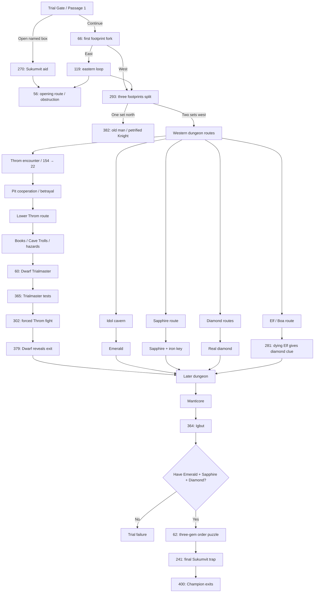

# Deathtrap Dungeon → Duel Master Battle
## Canonical extraction, port comparison, and physical-dungeon design

### Status of this extraction

The supplied *Deathtrap Dungeon* PDF is the canonical source for this work.

The existing `Glen-s-game` `deathtrap_ff` pack is useful as **technical scaffolding and an index of passage IDs**, but it is not reliable enough to use as story canon. Its own documentation says missing OCR was filled by editorial judgement. Direct comparison with the supplied book shows that some of those inferred passages replace major character scenes with unrelated combat.

This document therefore separates:

1. **book-verified facts and graph edges**;
2. **comparison findings about the existing pack**;
3. **the proposed Duel Master Battle adaptation**.

The companion JSON file contains the verified macrograph/backbone used by this design.

> Important limitation: this is a **verified macrograph and set of important passage edges**, not a claim that every one of all 400 passage-to-passage edges has been machine-verified. The PDF OCR is too noisy for a trustworthy one-pass automatic adjacency extraction. A full 400-node canonical graph should be built by verifying each candidate edge against the book rather than accepting OCR or the existing inferred graph.

---

# 1. What Deathtrap Dungeon actually is structurally

The book is not just a linear monster gauntlet.

Its design depends on:

- route choice;
- misleading branches;
- traps;
- item dependencies;
- information learned from other people;
- other contestants moving through the same dungeon;
- dangerous curiosity;
- occasional escape options;
- required gems for the final door;
- repeated attempts and player knowledge.

The book explicitly tells the player that there is a true route, that several attempts may be required, and that mapping the dungeon helps future runs.

For Duel Master Battle, that suggests a **Dungeon Run** rather than an ordinary RPG dungeon that the player clears room-by-room once.

John's permanent magical progression belongs to the wider game. The Trial itself should have its own run-specific state.

---

# 2. Verified macrograph



This is deliberately a **physical-design graph**, not a replacement for the detailed passage graph.

---

# 3. Entrance and rival-contestant setup

At the Trial entrance there are six contestants including the protagonist.

The other five are:

- two Barbarians;
- an elven woman;
- a plate-armoured Knight;
- a black-clad assassin.

The starting order matters because it explains why the dungeon contains fresh tracks and why John can find other contestants already dead, trapped or fighting ahead of him.

The Knight enters first, then the Elf, a Barbarian, the assassin, and then the protagonist.

## Physical implementation

Do not hide this in exposition.

Before John enters, let the player physically stand at the gate with the other contestants.

They should be visible sprites.

The Trial starts one by one.

When John eventually enters, the others are genuinely *ahead* in the fiction.

Their tracks, disturbed rooms, dead guards and later appearances then feel like consequences of a shared race rather than static dungeon decoration.

---

# 4. The entrance should become real space

The book's opening already translates cleanly.

### Crystal entrance corridor

John walks into a dim crystal-lit tunnel.

A stone table contains six boxes.

One bears his name.

He may open it or walk on.

Opening it gives a small aid package and Sukumvit's warning that the Trial requires useful items, not merely fighting skill.

### First fork

The first major junction should visibly contain:

- a painted white arrow pointing west;
- several sets of wet footprints going west;
- one set going east.

Nothing needs to be displayed as a dialogue menu.

The player simply chooses a corridor.

The tracks should remain visible enough that the player understands they are evidence.

This establishes the dungeon's core exploration language:

> Observe the room. Infer what previous contestants did. Decide whether to follow them.

---

# 5. Do not build 400 rooms

A numbered passage is not necessarily a physical room.

Many book passages are:

- the consequence of touching an object;
- a combat outcome;
- the second half of a trap;
- an item check;
- a die result;
- a continuation of the same corridor.

The physical game should combine these into coherent spaces.

A good rule is:

> One physical location may contain many source passages, but every important book choice and consequence must still be representable.

Keep passage IDs as provenance metadata.

Example:

```text
Room: THROM_PIT
Source passages:
22, 63, 184, 311, 323, 449
```

That is much better than making six separate maps.

---

# 6. Proposed physical zones

## Zone A — Trial Gate and Crystal Entrance

Contains:

- Trial entrance;
- contestants;
- Sukumvit;
- named aid boxes;
- first footprint junction;
- short east loop;
- first evidence of rival routes.

Purpose:

- establish competition;
- teach exploration;
- teach that other contestants are physically ahead;
- introduce dungeon run state.

## Zone B — Footprint Galleries

Contains:

- branching tracks;
- bell;
- side rooms;
- old man/statue riddle;
- evidence of traps and previous contestants.

The petrified Knight is especially important.

He began the Trial confidently in front of John. Later John recognizes him as a statue.

That makes the dungeon feel active and lethal without needing a cutscene showing his death.

## Zone C — Idol Cavern

Large memorable space:

- giant idol;
- jewelled eyes;
- two apparently stuffed bird guardians;
- climbable structure;
- Emerald.

The guardian encounter protects the Emerald.

Taking the wrong eye can still be catastrophically dangerous.

## Zone D — Throm Lower Route

This should be the social centre of the dungeon.

Contains:

- reunion with Barbarian;
- pit;
- rope decisions;
- lower tunnel;
- books;
- Cave Troll ambush;
- bone talisman;
- stalactite cavern;
- onward travel.

Throm should physically accompany John through this segment.

## Zone E — Dwarf Trialmaster Complex

Contains:

- locked chamber;
- Dwarf;
- secret testing room;
- probability/dice test;
- reaction/cobra test;
- arena;
- Throm's eventual forced re-entry;
- secret exit.

This is not a generic boss room.

It is a controlled, sadistic examination administered by an intelligent NPC.

## Zone F — Troglodyte River Cavern

Contains:

- large tribe;
- ritual;
- chase;
- bridge;
- underground river;
- hiding/diving routes;
- hollow tube utility.

Use movement/traversal rather than converting the entire population into combat encounters.

## Zone G — Trap and Monster Galleries

A network of dangerous branches containing selected canonical set-pieces:

- Mirror Demon gallery;
- Bloodbeast pool;
- boulder run;
- trapped chest;
- poison;
- Mimic/Imitator door;
- Goblins/Orcs;
- Rock Grub;
- Leprechauns;
- false exit chamber.

The aim is not to include every minor stat-changing incident in the first implementation. Prioritise distinctive decisions and traps that make routes memorable.

## Zone H — Upper/Service Layer

Contains:

- Trialmaster servants;
- former contestant/prisoner;
- wicker basket operator;
- Poison Ivy;
- service passages.

This helps communicate that the dungeon is an administered institution, not a naturally occurring cave.

## Zone I — Gem Routes

The Emerald, Sapphire and Diamond should require materially different exploration.

### Emerald
Environmental set-piece and guardian fight.

### Sapphire
Found with an iron key inside a box reached through the correct route.

### Diamond
The dungeon contains deceptive diamond imagery as well as the genuine gem. Preserve the possibility of risking your life for the wrong jewel.

NPC clues should gradually establish that gems matter before the player knows the complete answer.

## Zone J — Final Approach

The Manticore is the last major creature gate.

Winning leads into the final Trialmaster sequence.

## Zone K — Igbut and Victory Door

Igbut checks that John has:

- Emerald;
- Sapphire;
- Diamond.

Then he administers the three-slot ordering puzzle.

After the door is solved, even Igbut is vulnerable to Sukumvit's final trap.

Only then does John emerge.

---

# 7. Throm must be treated as a character, not an encounter ID

Throm is the most important adaptation opportunity in the book.

His useful state model is approximately:

```text
AHEAD
→ MET
→ UNEASY_ALLY
→ COOPERATING
→ WOUNDED
→ SEPARATED_BY_TRIALMASTER
→ DELIRIOUS_FORCED_OPPONENT
→ DEAD
```

With a possible betrayal branch:

```text
UNEASY_ALLY
→ BETRAYED
→ HOSTILE_IF_PATHS_CROSS
```

## Behaviour in the walkable world

Throm does not need sophisticated general-purpose follower AI.

Use authored companion behaviour.

He should:

- follow John through the relevant corridors;
- stop at room boundaries;
- inspect the pit;
- handle his rope;
- carry/light the torch;
- object to unfamiliar substances;
- urge John not to waste time reading;
- hear enemies before John at the Cave Troll encounter;
- visibly engage one Troll while John takes the other;
- react to dangerous magical objects;
- sometimes lead;
- sometimes wait;
- retain distrust even while cooperating.

The player should be able to walk beside him.

That alone will make the later arena scene substantially stronger.

## The forced Throm battle

Do not rewrite this as:

> Throm challenges you.

The book's point is that he is badly wounded, poisoned/delirious and being weaponised by the Trialmaster.

John objects.

The Dwarf does not care.

The player must defend himself.

This should be a full Duel Master confrontation because it is a climactic contest between two surviving competitors.

After the battle, do not immediately show a loot screen.

Return to the arena.

John sees Throm's body.

The Dwarf approaches with a loaded crossbow and reminds John that only he knows the way out.

---

# 8. Other contestants as moving story state

## Knight

At gate:

```text
ALIVE_AHEAD
```

Later:

```text
PETRIFIED_STATUE
```

The player recognizes him.

Do not turn this into a generic statue asset.

## Elf

At gate:

```text
ALIVE_AHEAD
```

Later John can find her being killed by / trapped with the Boa Constrictor.

If he rescues her, he is too late to save her life.

She provides one of the most important clues in the dungeon:

> the final door requires gems, including a diamond.

Then she dies and leaves useful possessions.

Keep this scene.

## Black-clad assassin and later Ninja

The book definitely contains both the black-clad assassin at the start and a later Ninja encounter.

This extraction does **not yet prove that they are the same individual**.

Do not silently merge them in implementation until the passage chain is verified.

It is fine for the visual design to let the player wonder whether the later figure is the same contestant.

## Second Barbarian

Likewise, do not make every later generic `Barbarian` reference automatically mean Throm without checking the surrounding passage chain.

## Former contestant / Trialmaster servant

This NPC is valuable worldbuilding.

He previously failed the Trial, accepted servitude instead of death, tried to escape, was mutilated and imprisoned.

If freed, he gives John a clue about the importance of precious stones.

That makes the dungeon feel operated over years, with human debris left by Sukumvit's system.

---

# 9. Which Fighting Fantasy combats become Duel Master battles?

The original Skill/Stamina system should not be imported wholesale.

Duel Master Battle already has a combat language.

Use the original monster statistics only as a **relative difficulty signal**.

Each creature encounter can instead define:

```text
weave_size
attack_spell_pool
ward_spell_pool
ward_pattern/rules
cast_timing
behaviour
escape_allowed
special_environmental_context
```

## Recommended mapping

| Book encounter | Adaptation |
|---|---|
| Giant Fly | Fast 1–2 slot creature duel; preserve escape |
| Guard Dogs / basic Goblins / Orcs | Small 1–2 slot battles |
| Flying Guardians | Two sequential small opponents or multi-target asymmetric encounter |
| Cave Trolls | John duels one while Throm fights the other in-world |
| Rock Grub | 2–3 slot creature duel; retreat remains possible |
| Mirror Demon | Environmental solutions first; Duel Master only if John chooses to fight |
| Bloodbeast | Dangerous multi-slot fight whose weakness can be learned before battle |
| Pit Fiend | Major 3–4 slot creature battle |
| Manticore | Four-slot final creature boss |
| Throm | Full character Duel Master battle |
| Dwarf Trialmaster | Primarily tests/social control, not generic Duel Master |
| Medusa | Lethal environmental/choice challenge rather than mandatory duel |
| Troglodyte tribe | Traversal/ritual/pursuit; only direct confrontation becomes combat |
| Poison Ivy | Social/payment/escape encounter; battle only if attacked |
| Igbut | Final logic Trialmaster, not a normal opponent |

This preserves the book's variety.

If every danger becomes a Ward battle, Deathtrap Dungeon stops being Deathtrap Dungeon.

---

# 10. The Bloodbeast should demonstrate knowledge affecting battle

The Bloodbeast is a particularly good adaptation candidate because the book gives it special behaviour and a discoverable weakness.

A player who has learned the relevant clue should enter the Duel Master encounter with an advantage.

Possible implementations include:

- one defensive slot revealed;
- first cast already partially constrained;
- a known spell family removed from candidate possibilities;
- weakness grants a special successful interaction once correctly targeted.

The exact mechanic can be tuned.

The important principle is:

> Exploration knowledge changes combat information.

That is an ideal fit for Duel Master Battle.

---

# 11. Preserve non-combat solutions

Several book encounters are memorable because direct fighting is not the only answer.

Do not discard that.

Examples include:

- smashing mirrors instead of duelling the Mirror Demon;
- using items on traps;
- using acid on the Imitator;
- paying or talking to NPCs;
- following the spirit girl's clue;
- using the river/tube route;
- accepting the Troglodyte ritual;
- escaping where explicitly allowed.

The dungeon should test observation and judgement as much as the Ward mechanic.

---

# 12. The final gem puzzle is already a Duel Master puzzle

This is the strongest mechanical bridge between the book and the current game.

The final lock has:

```text
3 positions
3 known gems
```

The problem is not discovering which gems exist — John must already possess the correct Emerald, Sapphire and Diamond.

The problem is their order.

Each failed arrangement receives aggregate positional feedback.

That is extremely close to Duel Master Battle's deduction language.

## Adapt it without changing it

Use the familiar Ward UI style:

```text
[A] [B] [C]
```

Player places:

```text
Emerald / Sapphire / Diamond
```

Igbut supplies the book's positional-result information.

Wrong attempts trigger the damaging energy blast.

Do **not** turn this into a normal spell Ward with six colours.

Its power is that the player suddenly recognises:

> Sukumvit's final mechanical lock obeys the same kind of positional reasoning I have been using in magical duels.

The book already gives us that connection.

---

# 13. Dungeon death and repeated attempts

A faithful adaptation should be dangerous.

But a mobile game should not waste the player's time.

Recommended model:

## Permanent outside the Trial

John retains:

- learned spell types;
- permanent weave capacity;
- wider-world story progress;
- achievements / completed major progression;
- player-discovered dungeon knowledge/map.

## Reset with a failed Dungeon Run

Reset:

- dungeon position;
- gems;
- dungeon-only keys;
- consumed dungeon items;
- temporary injuries/curses;
- creature states;
- Trialmaster state;
- contestant run states.

## Resume

Resume may restore the current active dungeon run.

## After death

Restart quickly at the Trial entrance.

Preserve a discovered map/notebook.

This translates the book's explicit advice to make a map and learn across repeated attempts into a reasonable mobile quality-of-life system.

---

# 14. Map knowledge

Do not reveal the whole dungeon immediately.

Possible persistent exploration states:

```text
UNKNOWN
SEEN
ENTERED
CLEARED
LETHAL_ROUTE_DISCOVERED
ITEM_ROUTE_DISCOVERED
```

The player's map can remember:

- rooms physically visited;
- known exits;
- known deaths;
- known required-item locations if personally discovered;
- symbols for notable unresolved objects.

Avoid giving the player information John has never acquired.

---

# 15. Temporary penalties instead of a second RPG stat game

The Fighting Fantasy book uses Skill, Stamina and Luck extensively.

Duel Master Battle does not need a second visible numerical combat system.

Translate only consequences that matter.

Possible run conditions:

```text
WOUNDED
POISONED
SLOWED
CURSED
DISORIENTED
WEAVE_DISRUPTED
```

Examples of effects:

- minimum cast delay slightly longer;
- maximum cast window shorter;
- one spell unavailable for first cast;
- one weave slot temporarily impaired;
- fewer permitted failed casts in the next encounter;
- movement slowed in a hazard.

Use sparingly.

The point is to preserve consequence without building an HP spreadsheet beside the core deduction game.

---

# 16. Data model recommendation

Keep implementation flexible, but the content needs clear authoritative state.

A dungeon location should be able to identify its book provenance.

For example:

```json
{
  "id": "throm_pit",
  "source_passages": [22, 63, 184, 311, 323, 449],
  "book_verified": true
}
```

Useful content concepts include:

### DungeonRunState

- current area;
- current spawn/checkpoint;
- visited locations;
- run inventory;
- gems;
- run conditions;
- trap flags;
- NPC/contestant states.

### EncounterDefinition

- opponent identity;
- creature/wizard;
- weave size;
- attack pool;
- Ward pool;
- timer behaviour;
- flee rules;
- preconditions;
- post-result state changes;
- source passages.

### ContestantState

Especially for:

- Knight;
- Elf;
- Throm;
- assassin;
- second Barbarian.

### Source provenance

Every adapted set-piece should have:

```text
source_passages
book_verified
adaptation_notes
```

Do not allow `judgement_inferred` material from the old pack into canonical game content without checking it.

---

# 17. Existing deathtrap_ff pack comparison

The old pack is useful for:

- passage numbering;
- file organisation;
- graph-validation ideas;
- content tooling;
- representing tests/effects/endings;
- automated reachability tests.

It is not safe as canonical content.

See the companion comparison CSV for concrete examples.

The most important failures found so far are:

- passage 22 replaces Throm's alliance scene with a Giant Spider;
- passage 281 replaces the dying Elf clue scene with a Skeleton;
- passage 302 replaces the forced Throm fight with a Giant Spider;
- passage 399 is incorrectly turned into a Giant Rat death despite the book continuing to 192;
- passage 60 loses one of its two important player choices.

These are not cosmetic OCR errors. They alter the story graph.

---

# 18. Verification policy for the full graph

Before implementing the entire dungeon, rebuild the canonical content set with explicit source status.

Suggested statuses:

```text
BOOK_VERIFIED
BOOK_VERIFIED_OCR_MESSY
NEEDS_PAGE_IMAGE_CHECK
NOT_YET_VERIFIED
```

Never use:

```text
INFERRED_AS_CANON
```

For each passage:

1. locate the passage in the supplied PDF;
2. capture its outgoing `turn to` references;
3. capture conditional requirements;
4. identify combat/test/death/item effects;
5. record relevant character state;
6. compare against existing pack;
7. fix discrepancies;
8. mark verified.

The existing pack can accelerate this process by proposing edges, but the PDF confirms them.

---

# 19. Canonical regression tests worth adding immediately

Before building maps, add source-fidelity tests for known failures:

```text
Passage 22:
must be Throm/Barbarian alliance
must not be Giant Spider

Passage 60:
must allow attack-Dwarf branch
must allow persuade-Throm branch

Passage 281:
must be dying Elf / diamond clue
must not be generic Skeleton

Passage 302:
must be forced Throm confrontation
must not be Giant Spider

Passage 399:
must continue to 192
must not be death

Final required gems:
Emerald
Sapphire
Diamond

Passage 62:
must expose six permutations
must retain positional feedback structure
```

These tests prevent the known inferred-port errors from re-entering the new game.

---

# 20. Recommended first playable Deathtrap slice

Do not build the whole labyrinth in one implementation pass.

A strong first slice is:

```text
Trial entrance
→ contestants enter
→ named box
→ first footprint fork
→ one dangerous branch
→ Throm encounter
→ pit interaction
→ lower route
→ books
→ Cave Troll parallel fight
→ Dwarf Trialmaster chamber
```

This slice proves nearly everything difficult:

- walkable branching dungeon;
- run state;
- footprints/evidence;
- traps;
- item interaction;
- companion following;
- social choices;
- asymmetric world combat;
- Duel Master integration;
- NPC state;
- transition into Trialmaster-controlled challenge.

Once that works, extend outward toward the three-gem structure and final route.

---

# 21. What success should feel like

John should enter thinking this is a dangerous maze.

After one or two attempts, the player should begin thinking:

- I remember what is behind that door.
- Those tracks probably belong to the contestants I saw outside.
- Last run I died taking that jewel.
- Throm can help me down that pit, but I do not entirely trust him.
- The Elf said I need a diamond.
- That apparent diamond was a trap.
- I still need to find the Sapphire.
- The spirit girl's clue tells me what to do at the water.
- The Manticore probably means I am near the end.

That is the *Deathtrap Dungeon* experience worth transferring into Duel Master Battle.

The Duel Master battle system supplies the game's combat language.

The book supplies the labyrinth, cruelty, traps, people, clues and route-learning challenge.
