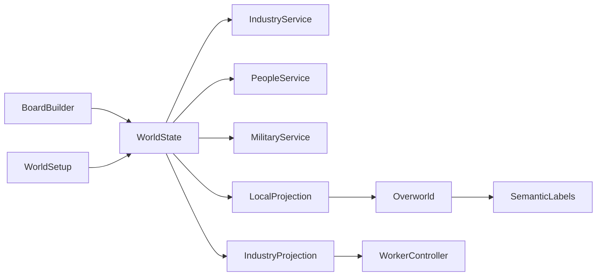

# CURRENT GAME ONTOLOGY

**Baseline:** `feature/g05-village-quest` @ `ff23066` + dirty working tree (2026-09-21).  
**Authority:** Implementation under `sim/dmb/` and `godot_project/client/`, cross-checked against build-pack contracts.  
**Status:** Descriptive of today — not a proposal.

Classification key: **ENTITY** | **ROLE / COMPONENT** | **PROCESS** | **PROJECTION** | **PRESENTATION**

---

## 1. Top-level structure (as coded)

Durable truth lives on one `WorldState` (`sim/dmb/core/state.py:WorldState`). Godot presents projections; it does not own these registries.

```text
WorldState
├── meta: world_id, world_version, ids, catalog_hash, definitions, rng
├── clock                          PROCESS (time)
├── player                         ENTITY (wizard — NOT in people)
├── board                          ENTITY topology + PRESENTATION buckets (fx_*, local_projections)
├── factions                       ENTITY
├── settlements                    ENTITY
├── buildings                      ENTITY
├── people                         ENTITY
├── carts                          ENTITY
├── units                          ENTITY (soldiers — separate from people)
├── formations                     ENTITY (ordered unit-id groups)
├── battles                        PROCESS aggregate
├── hazards                        ENTITY cubes + PROCESS catastrophe
├── stocks                         ENTITY ledger
├── orders                         PROCESS (construction)
├── roads                          ENTITY
├── quests                         PROCESS (bound to people/causes)
├── items                          ENTITY
├── leases                         PROCESS (encounters)
├── knowledge                      PROJECTION store (observer facts)
├── research / tech_draft / diplomacy
├── industry                       PROCESS state (channels, processors, routes, factories, layers)
└── tombstones                     ENTITY remnants
```

Orchestrator: `WorldSim` (`sim/dmb/core/world.py`) composes services and dispatches commands.



---

## 2. Concept catalogue

### 2.1 Place hierarchy

| Concept | Class | ID / store | Owner | Meaning today |
|---|---|---|---|---|
| **Hex** | ENTITY (immutable terrain) | axial hex on `board` | `BoardBuilder` at setup | One of 19 strategic hexes; terrain + number token; industrial layers attach here |
| **Node** | ENTITY | `node:*` in `board.nodes` | BoardBuilder / fixtures | Shared corner; settlements and player pose attach here; exits link nodes |
| **Edge / Road** | ENTITY | edge + `roads` | Construction / logistics | Strategic connectivity for carts; military/wizard travel do not require roads (C04/C07) |
| **Settlement** | ENTITY | `settlement:*` | ConstructionService / WorldSetup | Faction-owned site at a node: centre, warehouse, slots |
| **Local area** | PROJECTION + PRESENTATION | `area_id` on node / export | LocalProjectionService + Overworld | 48×48 (tunable) playable layout of **one strategic node** |
| **Dungeon / puzzle room** | PROCESS + PRESENTATION | lease + puzzle ids | Adventure / EncounterRegistry | Leased encounter; not a second durable board |
| **Entrance / exit** | PRESENTATION of topology | exit records on node | Travel command | Local door/portal mapped to real node adjacency |

**What “local area” means:** a disposable visual/play layout of the settlement node the wizard is currently at. Travel changes which node the **same** Overworld is projecting; it must not switch to a second simulation (`docs/INTEGRATED_RUNTIME_ARCHITECTURE.md`).

### 2.2 People and work

| Concept | Class | Registry | Notes |
|---|---|---|---|
| **Person** | ENTITY | `people[person:*]` | `PeopleService` — identity, alive/status, role, job, workplace, relationships, dialogue profile, knowledge hooks |
| **Job / job slot** | ROLE + PROCESS | `definitions["jobs"]` | `JobService` — binds `person_id` ↔ workplace; backfill creates a **new** person |
| **Worker** | ROLE | person with job / `profile_flags` containing `worker` | Not a separate entity. C09: “A worker is a persistent person” |
| **Leader / Anchor** | ROLE | same person record flags | Same ID; not a duplicate NPC (`people/registry.py:PROFILE_STATES`) |
| **Carrier** | ROLE + PRESENTATION | person + `job:carrier` + IndustryProjection row | Industrial delivery animation; motion is illustrative (GDD / C09) |
| **Attendant** | ROLE + PRESENTATION | person at processor/workplace | Stationary industry cue |
| **Quest stakeholder** | ROLE | person referenced by quest/cause | Ordinary Person with bindings (`QuestBinder` requires living person) |
| **NPC** | PRESENTATION language | — | **No Python type.** Occasional `definition_id` prefix `npc.*`. Godot entity kind `"npc"` in older/fixture paths |

### 2.3 Military

| Concept | Class | Registry | Notes |
|---|---|---|---|
| **Unit (soldier)** | ENTITY | `units[unit:*]` | `MilitaryService.spawn` — combat stats, faction, home, formation, lease. **No `person_id`** |
| **Formation** | ENTITY / PROCESS | `formations[formation:*]` | Ordered unit IDs + objective / engagement |
| **Battle** | PROCESS | `battles[battle:*]` | Local lease or off-screen resolve |
| **Observed soldier name** | PRESENTATION field | `unit.person_name` | `_ensure_unit_person_name` in `world.py` — name on Unit, **not** a Person record |

**Answers:**

- Is a Worker a Person? **Yes.**
- Is a Soldier a Person? **No (today).** Separate Unit entity.
- Is a Leader a Person? **Yes** (flag/role on Person).
- Is a quest-giver a special type? **No** — Person + quest/cause bindings.
- Is a Carrier a Person, Job, or presentation role? **Person + Job; presentation via IndustryProjection / WorkerController.**
- Is a military Unit an individual human or a game piece? **Persistent individual combat entity** (named when observed) **without** social/dialogue Person record.
- What is a Formation? **Ordered set of unit IDs with travel/engage objective.**
- Does “NPC” exist in Python? **No type.** Player-facing / Godot vocabulary.

### 2.4 Structures and industry

| Concept | Class | Store | Notes |
|---|---|---|---|
| **Building** | ENTITY | `buildings[building:*]` | Centre, warehouse, primary, processor shell, factory, etc. Health, slots, settlement/node |
| **Primary / resource site** | ROLE of building + PROCESS channel | building + `industry` primary bindings | Hex-adjacent production capacity |
| **Processor** | PROCESS binding | `industry.processors` | Recipe flow; often bound to a building |
| **Factory** | PROCESS meter | `industry.factories` / factory meters | Produces units over Game Time |
| **Route / connection** | PROCESS | `industry.routes` + projected connections | Directed resource flow; drives carrier jobs |
| **Warehouse / centre** | Building kinds | buildings | Settlement civic cores (C04) |
| **Local visual building** | PRESENTATION | Overworld entities from projection/export | Must map 1:1 to building ID when interactive |

### 2.5 Things, problems, player

| Concept | Class | Store | Notes |
|---|---|---|---|
| **Cart** | ENTITY | `carts[cart:*]` | Persistent cargo vehicle; real logistics (C05) |
| **Stock / store** | ENTITY ledger | `stocks` | Goods at nodes/warehouses |
| **Item** | ENTITY | `items[item:*]` | Inventory / ground / quest objects |
| **Hazard / cube** | ENTITY + PROCESS | `hazards` / `cube:*` | Catastrophe on a hex; causes; treatment |
| **Quest / Cause** | PROCESS (+ cause ENTITY occurrence) | `quests`, `definitions.causes` | World-cause driven; stakeholder is a Person |
| **Knowledge** | PROJECTION | `knowledge` | Observer-scoped facts for labels/dialogue |
| **Lease** | PROCESS | `leases` | Temporary ownership of duel/battle/puzzle fields |
| **Player (wizard)** | ENTITY | `player` dict | Pose, visits, inventory refs — **not** a Person |
| **Era / history** | PROCESS / archive | board era flags, layers, chronicles (partial) | Full EraService/HistoryService planned (C11); partial today |

---

## 3. Ownership matrix (today)

| Domain | Python owner | Godot role |
|---|---|---|
| Topology, settlements, buildings | BoardBuilder, WorldSetup, BuildingService, ConstructionService | Render / collide |
| People, jobs, dialogue profiles | PeopleService, JobService, DialogueResolver | Actors + dialogue UI |
| Industry throughput | IndustryService | WorkerController animation only |
| Carts / stocks | CartService, StockLedger, LogisticsService | Cart actors / cargo cues |
| Units / formations / battles | MilitaryService, FormationDirector, OffscreenBattleResolver | LocalBattleController when leased |
| Hazards | CatastropheService | Semantic targets / FX |
| Quests / causes | CauseTracker, QuestBinder, QuestService | Dialogue / prompts |
| Semantic labels / actions | SemanticResolver | WorldInteractionLabel / bridge |
| Local layout | LocalProjectionService | Overworld spawn by entity ID |
| Fixtures | `testing/fixtures.py` loaders | Shell scenes (g01…g05) |

---

## 4. Presentation path smells (observed)

| Smell | Evidence |
|---|---|
| Same Person can be static Overworld NPC **or** WorkerController actor | `INTEGRATED_RUNTIME_ARCHITECTURE.md` invariant; `overworld_export` skips industry people; `register_dynamic_person` |
| Unit gets human name without Person | `_ensure_unit_person_name` |
| IndustryProjection invents presentation-only carrier surplus rows | `IndustryProjection.ensure_carrier_jobs` / `presentation_only` |
| FX shells historically used miniature boards | FX-CLOCK/CARGO/INDUSTRY loaders in `fixtures.py`; FX-VILLAGE now binds BoardBuilder slice (dirty tree) |
| Older Godot village path still present | `village_test_runner.gd`, root README Village Test Mode language |
| Godot `"npc"` kind vs Python `person` | Adventure / village test entity kinds |
| One Building → wall tiles + door actor (not one shell) | `overworld_export.py` footprint/`#`/`D` + `kind: door` semantic |
| One Cart concept → `cart:*` deco **and** sometimes `person:cart` journey | `presentation/journeys.py`, FX-CARGO / G01–G02 shells |
| One Unit → Overworld NPC **or** G03 polygon **or** battle `UnitController` | Gate-specific shells |
| One Hazard cube → G04 diamond **or** G05 creature **or** leased duel board | `hazard_actor.gd` vs Overworld `creature` vs `duel_lease_adapter.gd` |
| Dynamic worker semantic `pos` stuck at `[0,0]` | `overworld.gd` `register_dynamic_person` — range vs moving actor |
| `bridge_talk` / `bridge_challenge` may not reach handlers on semantic use | `_perform_entity_action` early-return on `bridge_entity` |
| Rebuild may free WorkerController under `_actors_root` | `overworld.gd` `_finish_village_build` + G05 mount path |
| `VillageProjector` metadata without actors | `village_projector.gd` — fixture/T078 residue |

---

## 5. Fixture vs game

| Fixture | Role | Fixture-only risk |
|---|---|---|
| FX-CLOCK | Minimal travel/clock graph | Tiny board, not 19-hex |
| FX-CARGO | Cart + blockage rooms | Hand-authored 3-node graph |
| FX-INDUSTRY | Industry demo | Compact industry layout |
| FX-BATTLE | Battle lease demo | Battle-centric setup |
| FX-HAZARD | Hazard/duel demo | Hazard-centric setup |
| FX-VILLAGE | G05 integrated village | Must be BoardBuilder settlement projection; residual `fx_village` meta for quest solutions |

**Rule (current architecture):** fixtures may arrange deterministic initial state; they must not invent alternate clocks, industry, or identity kinds (`INTEGRATED_RUNTIME_ARCHITECTURE.md`).

---

## 6. Explicit FAQ (implementation answers)

| Question | Answer today |
|---|---|
| Worker = Person? | Yes |
| Soldier = Person? | No — Unit |
| Leader = Person? | Yes (role) |
| Quest-giver special type? | No |
| Carrier? | Person + job + presentation projection |
| Unit = human or piece? | Persistent individual combat entity without social Person |
| Formation? | Ordered unit-ID group |
| NPC in Python? | No |
| Building vs Processor? | Building is durable structure; processor is industry process binding often attached to a building |
| Resource site? | Primary channel / hex-linked production site |
| Cart? | Persistent cargo ENTITY |
| Hazard? | Typed catastrophe cube on a hex |
| Entrance? | Local presentation of a strategic exit |
| Local area vs Node? | Local area projects one Node for play |

See also: [PLAYER_WORLD_MODEL.md](PLAYER_WORLD_MODEL.md), [PROPOSED_CANONICAL_ONTOLOGY.md](PROPOSED_CANONICAL_ONTOLOGY.md), [JOE_DESIGN_DECISIONS.md](JOE_DESIGN_DECISIONS.md) D01–D03.
