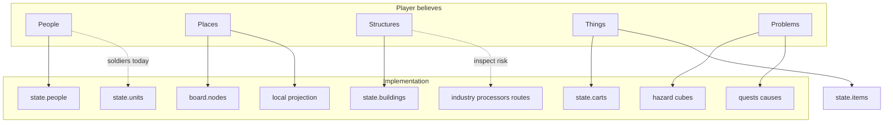

# PLAYER WORLD MODEL

What the player should conceptually believe exists — **not** the code registries.  
Compared against today’s implementation ([CURRENT_GAME_ONTOLOGY.md](CURRENT_GAME_ONTOLOGY.md)).

---

## 1. Intended player vocabulary

### PEOPLE

Named humans the wizard can meet, remember, and (usually) talk to.

Examples the player should think:

- Bren — a woodcutter at the cuttings  
- Mara — a factory worker whose line has stopped  
- Tovin — a soldier guarding the ridge  

The player should **not** need to know whether Bren is a `person:*` with a job slot and Tovin is a `unit:*` with a `person_name` field.

### PLACES

- the village (this settlement’s local streets)  
- woodland / ridge / ore slopes (surrounding hex character)  
- the road (path between places)  
- the dungeon / sluice works (a place you enter to solve a problem)  

“Hex”, “node”, “local projection” are engineering terms.

### STRUCTURES

- warehouse, centre, cuttings, works, factory, ruined centre  

Player language: buildings you can walk up to and inspect.  
Not: processor IDs, connection IDs, factory meters.

### THINGS

- cart with timber  
- letter, key, ward token  
- dropped quest object on the ground  

### PROBLEMS

- a demon on the ore slope  
- a shortage / broken sluice  
- a war approaching  
- a promise made to Mara  

Problems are causes in the world, not quest-engine UI states alone.

### YOU (the wizard)

A visitor with magic, pockets, and limited presence — not a faction commander.

---

## 2. What the player should never have to understand

| Leak | Where it tends to appear | Desired player experience |
|---|---|---|
| `person:…` / `building:…` / `unit:…` IDs | Labels, dialogue fallbacks | Names / occupations |
| Processor / route / connection IDs | Industry inspect text | “Ore works → factory is blocked” |
| Projection / WorkerController / lease jargon | Debug or accidental UI | Invisible |
| Fixture names (FX-VILLAGE, seed 507) | Playtest packets only | “this village” |
| Registries / services | Never | Never |
| Knowledge tokens / mint tokens | Debug | “you learned her name” |
| Presentation-only carrier / surplus jobs | If labelled oddly | Ordinary workers |

G05 known-defects already push public occupational labels and player-safe building observations — that direction matches this model.

---

## 3. Player model vs implementation model

### Alignment that already works

- Workers are real People with jobs (C09 / JobService).  
- Carts are real cargo entities.  
- Quests bind to living stakeholders and world causes (FX-VILLAGE solutions call industry/hazard owners).  
- Local village is a projection of a strategic node (intended FX-VILLAGE shape).

### Misalignment the player can feel

| Player expectation | Implementation today | Consequence |
|---|---|---|
| Every named human is “the same kind of being” | People vs Units | Soldiers look like people but lack dialogue/relationship Person records |
| Talking to villagers and soldiers feels similar | Talk mostly on Persons; Units use Observe/Destroy/Buff path | Uneven social world |
| Buildings explain shortages in plain language | Industry process internals easy to leak | Cognitive load / immersion break |
| Walking to the next place continues the same world | Travel + local unload must preserve IDs | If broken, feels like demo rooms |
| Working people are the same people you talk to | Static NPC export vs WorkerController must not duplicate | Double Bren / silent Bren risk |

---

## 4. Recommended player-facing categories (for UX writing)

Use these words in UI, tutorial, and dialogue:

1. **People** — anyone with a face and a name (pending Joe D01/D03 on soldiers)  
2. **Places** — village, wilds, road, dungeon  
3. **Buildings** — structures you inspect  
4. **Carts & goods** — what moves and what runs out  
5. **Armies & battles** — soldiers and fights (wording depends on D01)  
6. **Dangers** — demons, disasters  
7. **Promises** — quests stated as problems, not journal metadata  

Avoid in player text: processor, projection, registry, fixture, lease, node ID, hex ID (hex may appear later in strategic map UI if Joe wants Catan-facing language).

---

## 5. Open player-experience questions for Joe

Captured as decisions: **D01, D03, D05, D06, D07, D14** in [JOE_DESIGN_DECISIONS.md](JOE_DESIGN_DECISIONS.md).
