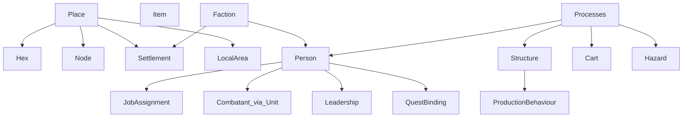

# PROPOSED CANONICAL ONTOLOGY

**Status:** Recommendation only — **not approved**.  
Every material departure from LOCKED / contract defaults is marked.

Prefer a small vocabulary a designer can explain without reading code.  
Respect C01: ordinary typed records and services — **not** an ECS framework or one subclass per content definition.

---

## 1. Recommended model (summary)

```text
WORLD
│
├── Place
│   ├── Hex            (strategic terrain cell)
│   ├── Node           (strategic corner / site attachment)
│   ├── Settlement     (faction site at a Node)
│   └── LocalArea      (playable projection of a Node)
│
├── Person             (all lasting human identities)
│   ├── identity / appearance / knowledge / relationships / goals / dialogue
│   ├── JobAssignment?     ROLE
│   ├── Combatant?         ROLE → specialised combat fields (or linked Unit record)
│   ├── Leadership?        ROLE
│   └── QuestBinding?      ROLE
│
├── Structure          (Building: centre, warehouse, works, factory shell, …)
│   └── ProductionBehaviour?  PROCESS attachment (primary/processor/factory meter)
│
├── Vehicle            (Cart — and later mounts/etc. if ever needed)
│
├── Item
│
├── Hazard             (catastrophe cube / typed danger)
│
├── Group              (Formation = ordered Combatants; not a human)
│
└── Processes
    ├── economy (Catan goods, stocks, orders)
    ├── logistics (routes, deliveries)
    ├── industry (layers, processors, factory meters)
    ├── war (battles, leases, off-screen resolve)
    ├── catastrophe
    ├── quests / causes
    └── era / history
```

**Wizard / Player** remains a distinct ENTITY (`player`), not a Person, unless Joe later wants the wizard to be socially modelled like NPCs (not required for G05–G07).

---

## 2. Smallest coherent concept set

If forced to name the minimum set for the intended game:

1. **Place** (Hex / Node / Settlement / LocalArea)  
2. **Person** (with optional roles)  
3. **Structure**  
4. **Vehicle (Cart)**  
5. **Item**  
6. **Hazard**  
7. **Faction** (organisation)  
8. **Processes** that mutate the above (economy, industry, war, quests, eras)

Everything else is a role, process field, or presentation.

---

## 3. Person / soldier recommendation

### Recommendation: **Model B** (Unit / Combatant references Person)

| Layer | Store |
|---|---|
| Social / dialogue / knowledge / relationships / history | `Person` |
| Combat stats / formation / lease / battlefield pose | `Unit` / `CombatantState` with **`person_id`** |

**Why not Model A (status quo)?**  
Player and GDD treat soldiers as named individuals who can matter to history and possibly quests. Status quo names Units without giving them a social home (`person_name` accident).

**Why not Model C (Combatant fields only on Person, delete Unit)?**  
Higher migration cost across G03/G04 combat, formations, leases, off-screen resolver, and C07 `UnitState` language. Risks a soft ECS by stuffing combat into Person.

**C01 compatibility:**  
Model B **keeps** separate `people` and `units` registries (C01 table intact) and adds an explicit link. Marked departure: today there is **no** `person_id` on units (`IMPLEMENTATION_ACCIDENT` / incomplete).

**DEPARTURE MARKERS:**

| Change | Vs |
|---|---|
| Require `unit.person_id` → living Person | Current implementation; soft vs C07 text that never forbade a link |
| Spawn unit creates or binds a Person | Current `MilitaryService.spawn` |
| Collapse may kill/disband Combatant while Person tombstone/displaced rules apply per Joe D12 | GDD civilian vs military wording |

Model A remains acceptable if Joe prioritises combat isolation and accepts soldiers as non-social entities with display names only.

---

## 4. Place recommendation

Keep C04 geometry:

- **Hex** — terrain & industrial layers  
- **Node** — settlement & Travel attachment  
- **Settlement** — ownership & civic buildings  
- **LocalArea** — presentation of one Node  

**DEPARTURE:** none from C04. Clarify in player language that countryside fantasy is *travel between node places*, unless Joe chooses contiguous overlays (D06).

---

## 5. Structure vs production recommendation

- **Structure** = Building ENTITY the player walks up to.  
- **ProductionBehaviour** = industry PROCESS bound to that structure (and/or hex for primaries).  

Player always sees Structure names; process IDs stay internal.

**DEPARTURE:** none — documentation/UX clarification of existing dual layer (X11).

---

## 6. NPC vocabulary recommendation

Use **Person** in design/engineering.  
Use **NPC** only as player-facing shorthand for “non-wizard Person (and, if Model B, any Person including soldiers)”.

Do not create an `NPC` type.

---

## 7. Fixtures recommendation

A fixture is a **named seed + setup profile** of the same WorldSetup / BoardBuilder pipeline — never an alternate ontology.

**DEPARTURE:** requires retiring fixture-only entity kinds over time (D09).

---

## 8. What this does *not* propose

- No ECS framework  
- No one class per content definition  
- No immediate save migration in this review task  
- No renumbering of gates  

Implementation waits on [JOE_DESIGN_DECISIONS.md](JOE_DESIGN_DECISIONS.md).

---

## 9. Diagram (recommended)


